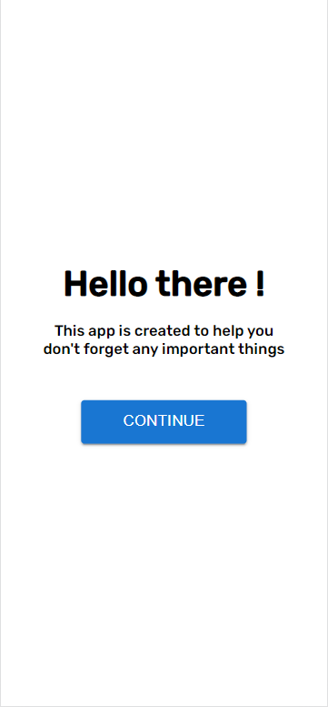
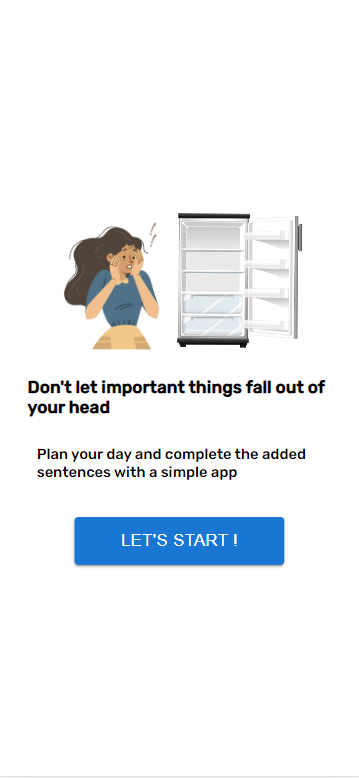
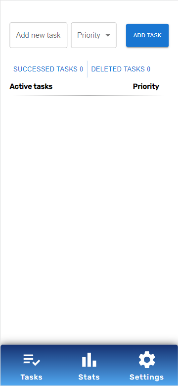
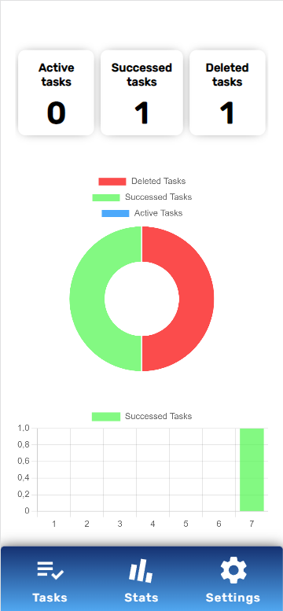
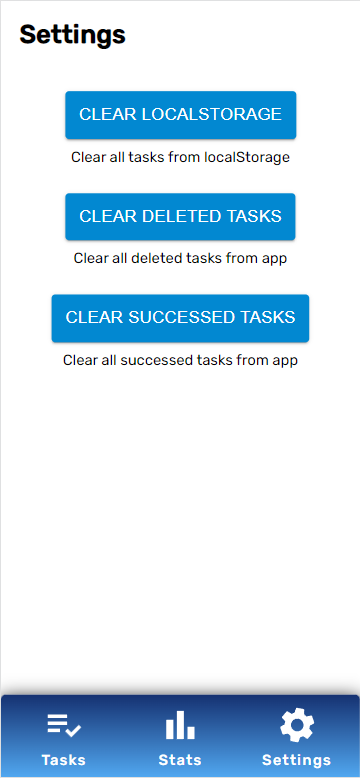
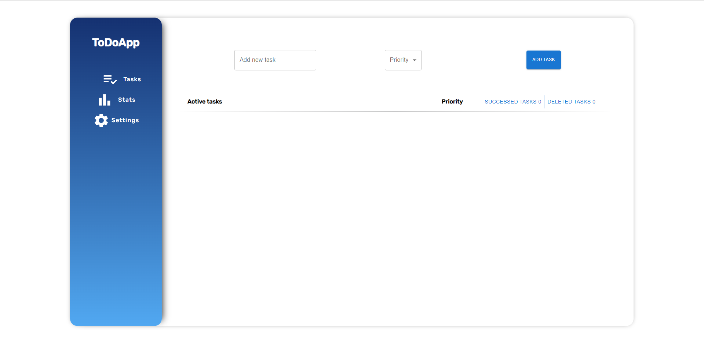
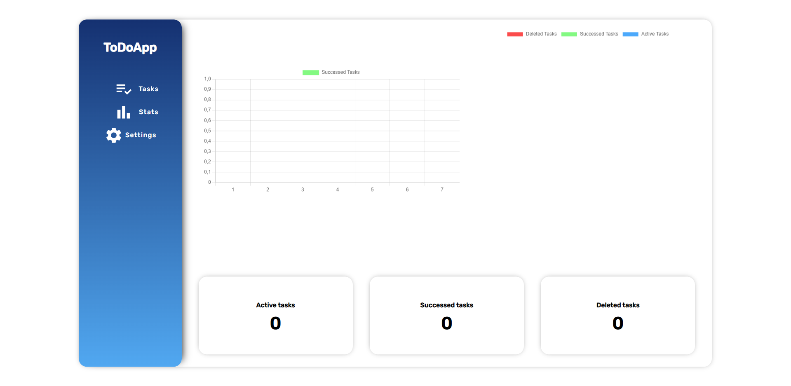
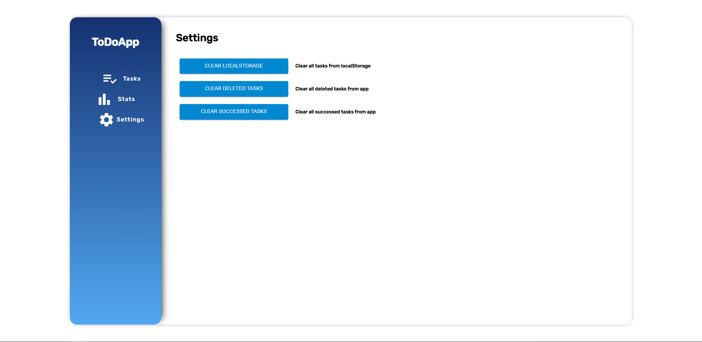

# To-do-app

## Demo avilable on website

https://ungrez.github.io/to-do-app/

## Table of contents

- [General info](#general-info)
- [Technologies](#technologies)
- [Screenshots](#screenshots)

## General info

App creating with create-react-app. To open project, clone repository and use:

npm install

## Technologies

- CSS
- React.js
- Chart.js
- React Router
- Material UI
- UUID
- React-spring

## Screenshots

